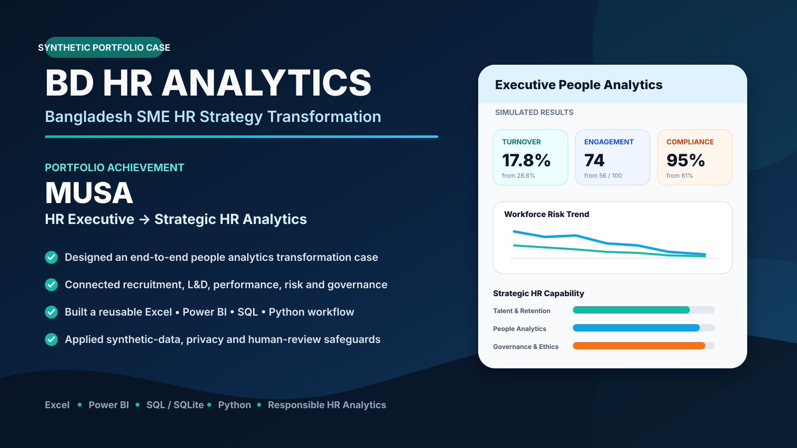
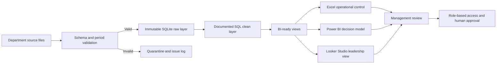

<p align="center">
  
</p>

# BD HR Analytics — KAS Ltd. Transformation Case

<p align="center">
  <strong>A fully synthetic Bangladesh export-manufacturing HRBP, people-analytics and operating-transformation portfolio.</strong>
</p>

<p align="center">
  
  
  
  
  
  
</p>

---

## Executive Overview

**KAS Ltd.** is a fictional export-oriented manufacturer operating inside the fictional **XYZ Export Processing Zone, Bangladesh**. It produces niche intimate-apparel products such as underwear, shapewear, technical base layers and private-label essentials for a synthetic portfolio of overseas buyers.

Commercial growth has outpaced the maturity of the company’s people and operating systems. Overtime dependence, specialist-skill shortages, machine downtime, inconsistent supervisor capability, buyer changes, data-quality weaknesses and cross-functional accountability gaps now affect delivery reliability, quality, cost, employee trust and reputation.

The case follows **Musa**, an HR professional with five years of experience, as he progresses from:

```text
Senior Executive — HR & People Analytics
        ↓
Acting HRBP Portfolio
        ↓
Assistant Manager — HR Business Partnering & People Analytics
        ↓
Long-term CHRO Capability Pathway
```

> **Synthetic-case notice:** KAS Ltd., XYZ Export Processing Zone, all employees, buyers, incidents, awards and performance outcomes in this repository are fictional. The project must not be represented as a real employer case or verified business impact.

---

## Strategic Case Structure

| Quarter | Management Context | HRBP Requirement |
|---|---|---|
| Q1 | Strategic reset after buyer escalation, overtime pressure and inconsistent delivery | Establish a controlled workforce and operating baseline |
| Q2 | Growth improves, but culture and management practices institutionalise unevenly | Align workforce planning, manager accountability and cross-functional decisions |
| Q3 | External recognition is followed by a coupled machine, planning, skill and workload failure | Reconstruct the incident without individual blame or unsupported causality |
| Q4 | The Board requests AI, automation and automatic dashboard refresh | Build data governance, role-based reporting and mandatory human review |

Read the full professional case: [`docs/CASE_STUDY.md`](docs/CASE_STUDY.md)

---

## Portfolio Achievement

The project demonstrates readiness for early mid-level HRBP and people-analytics work through:

- business and workforce diagnosis;
- influence across Production, Quality, Engineering, IE, Merchandising, Finance and Compliance;
- structured data assurance and SQL cleaning;
- Excel operational control;
- Power BI decision modelling;
- Looker Studio leadership reporting;
- incident reconstruction and corrective-action governance;
- responsible AI and automation design;
- executive communication and career progression toward CHRO capability.

---

## Integrated Challenge

The professional challenge requires approximately **10–16 focused hours** and combines:

1. data assurance;
2. SQLite and DBeaver modelling;
3. Excel operational review;
4. Power BI decision pages;
5. Looker Studio management reporting;
6. future-data refresh governance;
7. an HRBP decision memo.

[Open the integrated challenge brief](docs/KAS_LTD_INTEGRATED_CHALLENGE_BRIEF.md)

### Power BI Decision Pages

1. Executive Performance and Risk  
2. Workforce Stability  
3. Production People Risk  
4. Talent and Specialist Skill Pipeline  
5. Manager Capability and Culture  
6. Q3 Incident Reconstruction  
7. Q4 Automation and Governance Readiness  

---

## Data and Evidence Boundary

The current repository contains a synthetic analytical baseline for workforce, recruitment, learning and HR KPI practice. The professional KAS Ltd. case also proposes additional manufacturing-oriented datasets such as machine downtime, quality incidents, production-line KPIs and buyer-order changes.

Those proposed datasets are challenge extensions and should not be treated as already published evidence unless the corresponding files exist in the repository.

All analysis must:

- preserve canonical raw data;
- document transformations;
- distinguish supported findings from provisional interpretations;
- avoid presenting before-and-after movement as causal proof;
- retain accountable human judgement for employment decisions.

---

## Analytics Workflow



---

## Tools and Platforms

```text
Excel • Power BI • Looker Studio • Python • SQL • SQLite • DBeaver • GitHub • Kaggle
```

---

## Repository Structure

```text
bd-hr-analytics/
├── .github/
│   ├── workflows/
│   ├── ISSUE_TEMPLATE/
│   ├── CODEOWNERS
│   └── PULL_REQUEST_TEMPLATE.md
├── assets/
├── data/
│   ├── raw/
│   ├── processed/
│   ├── dictionary/
│   └── csv/
├── dashboards/
│   ├── excel/
│   ├── power-bi/
│   └── looker-studio/
├── analysis/notebooks/
├── sql/sqlite/
├── scripts/
├── database/
├── metadata/
├── docs/
│   └── governance/
├── governance/rulesets/
├── participant-submissions/
│   ├── templates/
│   └── solutions/
├── README.md
├── DATA_PROVENANCE.md
├── CITATION.cff
├── CHANGELOG.md
├── RELEASE_NOTES.md
└── bd-hr-analytics-unified-project.zip
```

---

## Quick Start

### Review the Case

1. Read [`docs/CASE_STUDY.md`](docs/CASE_STUDY.md).
2. Select a workstream from [`docs/KAS_LTD_INTEGRATED_CHALLENGE_BRIEF.md`](docs/KAS_LTD_INTEGRATED_CHALLENGE_BRIEF.md).
3. Review the central CSV files in [`data/csv/`](data/csv/).
4. Open the Excel dashboard in [`dashboards/excel/`](dashboards/excel/).
5. Review Power BI guidance in [`dashboards/power-bi/README.md`](dashboards/power-bi/README.md).

### Build the SQLite Database

```bash
python scripts/build_sqlite_database.py
```

Then open:

```text
database/bd_hr_analytics.sqlite
```

in DBeaver or another SQLite client. Full instructions are in [`sql/README.md`](sql/README.md).

---

## Participant Submissions

Participants may contribute original solutions through the controlled workspace:

[`participant-submissions/`](participant-submissions/)

Required contribution path:

```text
participant-submissions/solutions/<github-username>/<challenge-id>/
```

Required pull-request target:

```text
participant-review
```

Participant submissions must **not** target or merge directly into `main`. Promotion to `main` requires a separate maintainer-controlled pull request after validation.

- [Participant workspace](participant-submissions/README.md)
- [Submission governance](docs/PARTICIPANT_SUBMISSION_GOVERNANCE.md)
- [Review rubric](participant-submissions/REVIEW_RUBRIC.md)
- [Solution template](participant-submissions/templates/SOLUTION_README_TEMPLATE.md)

---

## Repository Governance

The protected `main` branch rejects direct updates and requires pull requests with status checks. Additional governance templates are stored in [`governance/rulesets/`](governance/rulesets/).

| Governance Resource | Purpose |
|---|---|
| [`governance/rulesets/default_branch_pull_request_governance.json`](governance/rulesets/default_branch_pull_request_governance.json) | Default branch pull-request protection template |
| [`governance/rulesets/participant_review_branch_governance.json`](governance/rulesets/participant_review_branch_governance.json) | Participant review branch protection template |
| [`governance/rulesets/semantic_version_tag_protection.json`](governance/rulesets/semantic_version_tag_protection.json) | Immutable semantic-version tags |
| [`docs/governance/GITHUB_PROTECTION_IMPLEMENTATION_GUIDE_BN.md`](docs/governance/GITHUB_PROTECTION_IMPLEMENTATION_GUIDE_BN.md) | Bangla implementation guide |
| [`.github/workflows/participant-submission-governance.yml`](.github/workflows/participant-submission-governance.yml) | Rejects participant submissions targeting the wrong branch |

Storing a ruleset JSON does not activate it automatically; repository administrators must import or recreate it through GitHub repository settings.

---

## Documentation

| Guide | Purpose |
|---|---|
| [`docs/CASE_STUDY.md`](docs/CASE_STUDY.md) | Professional Q1–Q4 KAS Ltd. case narrative |
| [`docs/KAS_LTD_INTEGRATED_CHALLENGE_BRIEF.md`](docs/KAS_LTD_INTEGRATED_CHALLENGE_BRIEF.md) | Tool-integrated participant assignment |
| [`docs/PARTICIPANT_SUBMISSION_GOVERNANCE.md`](docs/PARTICIPANT_SUBMISSION_GOVERNANCE.md) | Contribution and review rules |
| [`docs/PROJECT_USAGE_GUIDE.md`](docs/PROJECT_USAGE_GUIDE.md) | Complete project workflow |
| [`docs/PROMOTION_PORTFOLIO.md`](docs/PROMOTION_PORTFOLIO.md) | Career and interview positioning |
| [`docs/ETHICS_AND_LIMITATIONS.md`](docs/ETHICS_AND_LIMITATIONS.md) | Responsible people-analytics safeguards |
| [`docs/PROJECT_RULES_ALIGNMENT.md`](docs/PROJECT_RULES_ALIGNMENT.md) | Applied and excluded unified project rules |
| [`DATA_PROVENANCE.md`](DATA_PROVENANCE.md) | Synthetic source, generation and limitations |
| [`sql/README.md`](sql/README.md) | DBeaver, SQLite and data-cleaning workflow |
| [`RELEASE_NOTES.md`](RELEASE_NOTES.md) | Current release summary |

---

## Ethics and Responsible Use

- No real personal or confidential employee data is included.
- Synthetic status must remain visible in every public output.
- Employee-risk scores are discussion prompts, not decisions.
- Do not use the project to automate hiring, termination, promotion, discipline or medical decisions.
- Before-and-after movement is descriptive and does not establish causality.
- Any production adaptation requires lawful collection, privacy controls, bias testing, validation and accountable human oversight.

---

## Download

[Download the unified project ZIP](bd-hr-analytics-unified-project.zip)

The same clean archive is intended for GitHub portfolio distribution and Kaggle publication.

---

## Citation

```text
Musa. (2026). BD HR Analytics: KAS Ltd. HR Business Partnership and Operating Transformation Case (Version 0.3.0) [Synthetic data and analytics portfolio].
```

Machine-readable citation metadata: [`CITATION.cff`](CITATION.cff)

---

## Author

**Musa**  
HR Business Partnering • People Analytics • Strategic HR Transformation

## Licence

- Code and scripts: MIT
- Synthetic dataset and documentation: CC BY 4.0

See [`DATA_PROVENANCE.md`](DATA_PROVENANCE.md) for scope and attribution guidance.
