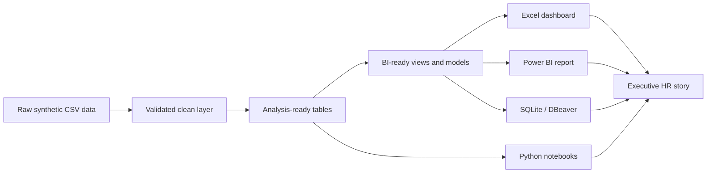

<p align="center">
  
</p>

# 🚀 BD HR Analytics

<p align="center">
  <strong>Bangladesh SME HR Strategy Transformation — a complete synthetic people-analytics portfolio.</strong>
</p>

<p align="center">
  
  
  
  
  
  
</p>

---

## 📌 Executive Overview

**Nabodoy Commerce & Services Ltd.** is a fictional Bangladesh-based startup growing into an SME. Rapid headcount growth created connected people challenges: turnover, early attrition, absence, overtime, recruitment delays, manager capability gaps, inconsistent performance practices and weak compliance visibility.

This portfolio shows how **Musa**, positioned as an HR Executive, can diagnose those problems, design coordinated HR interventions and communicate the results through Excel, Power BI, SQL, SQLite, Python and Looker Studio.

> **Important:** The company, employees, results and story are completely synthetic. Nothing in this repository represents a real employer or real employee.

## 🎯 Portfolio Achievement

The project demonstrates readiness to move from operational HR reporting toward strategic HR work by showing:

- business and workforce diagnosis;
- structured talent, learning and performance interventions;
- dashboard storytelling and KPI governance;
- SQL data cleaning and BI-ready modelling;
- responsible people analytics with human review;
- executive communication and portfolio presentation.

## 📊 Project Snapshot

| Area | Portfolio output |
|---|---|
| Business problem | Startup-to-SME people-system maturity gap |
| Data | Synthetic workforce, recruitment, learning and KPI CSV files |
| Excel | Executive dashboard and scorecards |
| Power BI | Six-page design system, DAX, theme and model guidance |
| SQL | DBeaver/SQLite schema, cleaning pipeline, views and analysis queries |
| Python | Diagnostic and intervention-impact notebooks |
| Governance | Ethics, limitations, provenance and rules-alignment documentation |
| Distribution | One unified GitHub/Kaggle project archive |

## 📈 Simulated Transformation Outcomes

| KPI | Baseline | Simulated result |
|---|---:|---:|
| Annualised turnover | 28.6% | 17.8% |
| 90-day early attrition | 24.1% | 12.1% |
| Absenteeism | 12.7% | 7.6% |
| Time-to-fill | 53 days | 32 days |
| Overtime cost ratio | 18.4% | 10.9% |
| Engagement score | 56/100 | 74/100 |
| Manager effectiveness | 58/100 | 77/100 |
| Compliance documentation | 61% | 95% |

These values support portfolio storytelling only. They are descriptive simulated outcomes and do not prove causality.

## 🧰 Tools and Platforms

```text
Excel • Power BI • Looker Studio • Python • SQL • SQLite • DBeaver • GitHub • Kaggle
```

## 🧭 Analytics Workflow



## 🗂️ Repository Structure

```text
bd-hr-analytics/
├── assets/
│   ├── cover/
│   └── dashboard previews
├── data/
│   ├── raw/
│   ├── processed/
│   ├── dictionary/
│   └── csv/
├── dashboards/
│   ├── excel/
│   ├── power-bi/
│   └── looker-studio/
├── analysis/
│   └── notebooks/
├── sql/
│   └── sqlite/
├── scripts/
├── database/
├── metadata/
├── docs/
├── README.md
├── DATA_PROVENANCE.md
├── CITATION.cff
├── CHANGELOG.md
├── RELEASE_NOTES.md
└── bd-hr-analytics-unified-project.zip
```

The final unified ZIP is intentionally retained as the single distribution asset. Historical duplicate archives are not stored.

## ⚡ Quick Start

### Review the project

1. Read [`docs/CASE_STUDY.md`](docs/CASE_STUDY.md).
2. Open the Excel dashboard in [`dashboards/excel/`](dashboards/excel/).
3. Review the six Power BI concepts in [`dashboards/power-bi/dashboard-images/`](dashboards/power-bi/dashboard-images/).
4. Inspect the central CSV files in [`data/csv/`](data/csv/).

### Build the SQLite database

```bash
python scripts/build_sqlite_database.py
```

Then open:

```text
database/bd_hr_analytics.sqlite
```

in DBeaver or another SQLite client. Full instructions are in [`sql/README.md`](sql/README.md).

### Build the Power BI report

Follow [`dashboards/power-bi/README.md`](dashboards/power-bi/README.md) to import CSVs, create the model, add DAX measures and rebuild the six report pages.

## 📚 Documentation

| Guide | Purpose |
|---|---|
| [`docs/PROJECT_USAGE_GUIDE.md`](docs/PROJECT_USAGE_GUIDE.md) | Complete project workflow |
| [`docs/PROMOTION_PORTFOLIO.md`](docs/PROMOTION_PORTFOLIO.md) | Career and interview positioning |
| [`docs/ETHICS_AND_LIMITATIONS.md`](docs/ETHICS_AND_LIMITATIONS.md) | Responsible people-analytics safeguards |
| [`docs/PROJECT_RULES_ALIGNMENT.md`](docs/PROJECT_RULES_ALIGNMENT.md) | Applied and excluded unified project rules |
| [`DATA_PROVENANCE.md`](DATA_PROVENANCE.md) | Synthetic source, generation and limitations |
| [`sql/README.md`](sql/README.md) | DBeaver, SQLite and data-cleaning workflow |
| [`dashboards/power-bi/README.md`](dashboards/power-bi/README.md) | Native Power BI build guide |
| [`RELEASE_NOTES.md`](RELEASE_NOTES.md) | Current release summary |

## 🧪 Practice Levels

**Beginner:** filtering, pivot tables, basic charts and descriptive KPI review.

**Intermediate:** SQL cleaning, joins, Power Query, KPI modelling and dashboard development.

**Advanced:** reproducible SQLite pipelines, BI-ready views, DAX, validation and ethical model review.

## ⚖️ Ethics and Responsible Use

- No real personal or confidential employee data is included.
- Synthetic status must remain visible in every public output.
- Employee-risk scores are discussion prompts, not decisions.
- Do not use the project for hiring, termination, promotion, discipline or medical decisions.
- Before-and-after movement is descriptive and does not establish causality.
- Any production adaptation requires lawful data collection, privacy controls, validation and human oversight.

## 📦 Download

[Download the unified project ZIP](bd-hr-analytics-unified-project.zip)

The same clean archive can be used for GitHub portfolio distribution and Kaggle publication.

## 📖 Citation

```text
Musa. (2026). BD HR Analytics: Bangladesh SME HR Strategy Transformation (Version 0.3.0) [Synthetic data and analytics portfolio].
```

Machine-readable citation metadata: [`CITATION.cff`](CITATION.cff)

## 👤 Author

**Musa**  
HR Executive • People Analytics • Strategic HR Transformation

## 📄 Licence

- Code and scripts: MIT
- Synthetic dataset and documentation: CC BY 4.0

See [`DATA_PROVENANCE.md`](DATA_PROVENANCE.md) for scope and attribution guidance.
