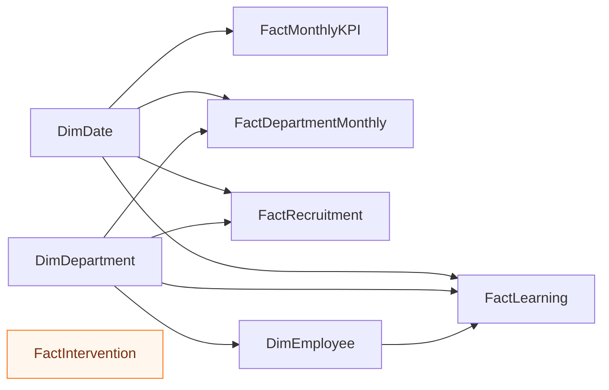

# 📊 Power BI — HR Strategy Analytics Dashboard

<p align="center">
  <strong>Build a six-page executive people-analytics report for a synthetic Bangladesh SME transformation case.</strong>
</p>

<p align="center">
  
  
  
  
  
  
</p>

---

## 🧭 Documentation Map

| Guide | Purpose |
|---|---|
| [`../../docs/PROJECT_USAGE_GUIDE.md`](../../docs/PROJECT_USAGE_GUIDE.md) | Full repository workflow |
| [`../../docs/PROMOTION_PORTFOLIO.md`](../../docs/PROMOTION_PORTFOLIO.md) | Career and interview positioning |
| [`../../docs/ETHICS_AND_LIMITATIONS.md`](../../docs/ETHICS_AND_LIMITATIONS.md) | Responsible people-analytics safeguards |
| [`data_model.md`](data_model.md) | Recommended Power BI relationships |
| [`measures.dax`](measures.dax) | Starter DAX measures |
| [`theme.json`](theme.json) | Report theme |

---

## 🎯 Purpose

This folder contains the guidance and assets required to build a native Power BI report for the fictional company **Nabodoy Commerce & Services Ltd.**

The report should help leadership understand:

- workforce growth and turnover;
- department people risk;
- recruitment speed and quality;
- learning and manager capability;
- performance and employee experience;
- compliance and strategic initiative progress.

> All data is synthetic and intended for portfolio practice, education and dashboard prototyping.

---

## ⚡ Quick Start

1. Download or clone the repository.
2. Open **Power BI Desktop**.
3. Select **Get Data → Text/CSV**.
4. Import files from [`../../data/csv/`](../../data/csv/).
5. Follow [`data_model.md`](data_model.md).
6. Create a dedicated measure table.
7. Add measures from [`measures.dax`](measures.dax).
8. Import [`theme.json`](theme.json) through **View → Themes → Browse for themes**.
9. Rebuild the six pages using [`dashboard-images/`](dashboard-images/) as references.
10. Save the final report as:

```text
BD_HR_Strategy_Analytics_Dashboard.pbix
```

---

## 🧰 Included Assets

| Asset | Purpose | How to use |
|---|---|---|
| [`data_model.md`](data_model.md) | Star-schema guidance | Build relationships before visuals |
| [`measures.dax`](measures.dax) | Starter KPI calculations | Copy into a measure table |
| [`theme.json`](theme.json) | Consistent colour and formatting | Import through the Themes menu |
| [`dashboard-images/`](dashboard-images/) | High-resolution page references | Rebuild page layouts |
| [`mockups/`](mockups/) | Alternative visual concepts | Use for design inspiration |
| [`power-bi-dashboard-images.zip`](power-bi-dashboard-images.zip) | Offline image bundle | Extract locally |
| [`../../data/csv/`](../../data/csv/) | Central dataset folder | Use as the primary data source |

---

## 👥 Task Assignment

| Task ID | Assigned to | Priority | Deliverable | Status |
|---|---|---:|---|---|
| PBI-01 | Musa | High | Import and profile all CSV files | Ready |
| PBI-02 | Musa | High | Create `DimDate` and `DimDepartment` | Ready |
| PBI-03 | Musa | High | Configure one-to-many relationships | Ready |
| PBI-04 | Musa | High | Create and format DAX measures | Ready |
| PBI-05 | Musa | High | Build Executive Overview | Pending build |
| PBI-06 | Musa | High | Build Workforce & Turnover | Pending build |
| PBI-07 | Musa | Medium | Build Talent Acquisition | Pending build |
| PBI-08 | Musa | Medium | Build Learning & Manager Capability | Pending build |
| PBI-09 | Musa | Medium | Build Performance & Employee Experience | Pending build |
| PBI-10 | Musa | Medium | Build Compliance, Risk & Initiatives | Pending build |
| PBI-11 | Musa | High | Test calculations, slicers and interactions | Pending build |
| PBI-12 | Musa | High | Export screenshots and add `.pbix` | Pending build |
| PBI-13 | Musa | High | Complete ethics and release review | Pending release |

### Definition of done

A task is complete when:

- the correct source table and measure are used;
- calculations are validated against CSV totals;
- slicers and cross-highlighting work correctly;
- number, percentage and currency formats are consistent;
- the page includes a visible **Synthetic Demo Data** label;
- employee-level risk is presented only as a human-review prompt;
- the page is readable at normal zoom and presentation view.

---

## 🗂️ Recommended Star Schema



### Relationship rules

- Use one-to-many relationships from dimensions to facts.
- Prefer single-direction filters.
- Mark the calendar table as the official date table.
- Store percentage values as decimals and format them in the model.
- Avoid many-to-many relationships unless a bridge table is documented.
- Keep intervention tracking standalone unless shared dimensions are required.

---

## 📐 Six Report Pages

### 1. Executive Overview

**Decision:** Where does leadership need to focus now?

Recommended visuals:

- headcount;
- turnover;
- absenteeism;
- time-to-fill;
- engagement;
- compliance;
- trend chart;
- department risk ranking;
- initiative progress;
- leadership insight box.

Reference: [`dashboard-images/01-executive-overview.png`](dashboard-images/01-executive-overview.png)

### 2. Workforce & Turnover

**Decision:** Which workforce groups and departments have the greatest retention risk?

Recommended visuals:

- active headcount;
- exits;
- annualised turnover;
- early attrition;
- retention;
- average tenure;
- turnover trend;
- department comparison;
- exit-reason analysis.

Reference: [`dashboard-images/02-workforce-turnover.png`](dashboard-images/02-workforce-turnover.png)

### 3. Talent Acquisition

**Decision:** Is recruitment becoming faster without reducing hire quality?

Recommended visuals:

- time-to-fill;
- cost per hire;
- applicants;
- interview-to-offer rate;
- offer acceptance;
- 90-day retention;
- recruitment funnel;
- source quality;
- hiring by department.

Reference: [`dashboard-images/03-talent-acquisition.png`](dashboard-images/03-talent-acquisition.png)

### 4. Learning & Manager Capability

**Decision:** Are development programmes improving manager and workforce capability?

Recommended visuals:

- training completion;
- learning hours;
- assessment improvement;
- manager effectiveness;
- succession readiness;
- skill-gap closure;
- programme comparison;
- manager effectiveness versus team performance.

Reference: [`dashboard-images/04-learning-manager-capability.png`](dashboard-images/04-learning-manager-capability.png)

### 5. Performance & Employee Experience

**Decision:** Is performance sustainable, or is it supported by excessive absence and overtime?

Recommended visuals:

- engagement;
- performance;
- absenteeism;
- overtime ratio;
- wellbeing;
- recognition participation;
- department comparison;
- absence versus overtime scatter plot;
- action-priority table.

Reference: [`dashboard-images/05-performance-employee-experience.png`](dashboard-images/05-performance-employee-experience.png)

### 6. Compliance, Risk & Strategic Initiatives

**Decision:** Are HR governance and transformation actions on track?

Recommended visuals:

- compliance completion;
- policy acknowledgement;
- audit issues;
- people-risk index;
- initiative completion;
- AI-assisted task adoption;
- compliance trend;
- department risk ranking;
- initiative tracker.

Reference: [`dashboard-images/06-compliance-risk-strategic-initiatives.png`](dashboard-images/06-compliance-risk-strategic-initiatives.png)

---

## 🧮 Starter DAX

The supplied [`measures.dax`](measures.dax) includes starter calculations.

```DAX
Headcount =
MAX ( FactMonthlyKPI[headcount] )

Turnover Rate =
AVERAGE ( FactMonthlyKPI[annualized_turnover_rate] )

Absenteeism Rate =
AVERAGE ( FactMonthlyKPI[absenteeism_rate] )

Average Engagement =
AVERAGE ( FactMonthlyKPI[avg_engagement_score] )
```

Recommended additions:

```DAX
Net Headcount Change =
SUM ( FactMonthlyKPI[hires] ) - SUM ( FactMonthlyKPI[exits] )

Average Time to Fill =
AVERAGE ( FactMonthlyKPI[avg_time_to_fill_days] )

Training Completion Rate =
AVERAGE ( FactMonthlyKPI[training_completion_rate] )

Compliance Completion Rate =
AVERAGE ( FactMonthlyKPI[compliance_documentation_rate] )
```

Validate table and column names after Power Query transformations.

---

## 🎛️ Recommended Slicers

| Slicer | Pages |
|---|---|
| Date range | All analytical pages |
| Department | All pages |
| Phase | Executive and intervention pages |
| Risk band | Workforce and risk pages |
| Employment status | Workforce page |
| Recruitment source | Talent Acquisition |
| Learning programme | Learning page |
| Initiative status | Compliance and initiatives |

Use only slicers that materially change the management decision.

---

## 🧑‍💻 Usability Guide

### Beginner

Start with:

1. `monthly_hr_kpis.csv`
2. `department_scorecard.csv`
3. `intervention_impact.csv`

Build the Executive Overview before importing employee, recruitment and learning detail.

### Portfolio builder

Use the report to demonstrate:

- HR business acumen;
- data modelling;
- DAX capability;
- dashboard storytelling;
- intervention planning;
- responsible employee-data use.

### Interview presentation

Explain the project through:

1. business problem;
2. connected diagnosis;
3. intervention design;
4. simulated outcome;
5. remaining risk;
6. ethical limitation.

### Self-practice

- recreate one page without copying it exactly;
- replace one visual with a more decision-useful design;
- add tooltip and drill-through pages;
- build a mobile layout;
- write five new measures;
- explain why before-and-after movement does not prove causation.

---

## ✅ Quality Assurance

### Data

- [ ] CSV files load without errors.
- [ ] Dates use the correct data type.
- [ ] Percentages are stored and formatted consistently.
- [ ] Employee IDs are unique where expected.
- [ ] Missing values are reviewed.

### Model

- [ ] Relationships are one-to-many where intended.
- [ ] Filter directions are controlled.
- [ ] The date table covers the full reporting period.
- [ ] No ambiguous filter path exists.
- [ ] Measures are stored in a dedicated table.

### Visuals

- [ ] Titles describe a business question.
- [ ] Colours remain consistent across pages.
- [ ] Risk does not rely on colour alone.
- [ ] Data labels are readable.
- [ ] Slicers are synchronised appropriately.
- [ ] Decorative elements do not obscure data.

### Responsible use

- [ ] Every page shows a synthetic-data notice.
- [ ] Employee risk requires human review.
- [ ] No visual claims proven causation.
- [ ] No real personal or confidential data is present.
- [ ] Accessibility checks are complete.

---

## 📦 Final Deliverables

```text
dashboards/power-bi/
├── BD_HR_Strategy_Analytics_Dashboard.pbix
├── README.md
├── data_model.md
├── measures.dax
├── theme.json
├── dashboard-images/
├── mockups/
└── power-bi-dashboard-images.zip
```

The native `.pbix` file is the main remaining practice deliverable.

---

## 🚀 Release Gate

Before a portfolio release:

- [ ] add the final `.pbix` file;
- [ ] export six high-resolution dashboard screenshots;
- [ ] verify every report page against the QA checklist;
- [ ] update `VERSION` and `CHANGELOG.md`;
- [ ] confirm the unified project ZIP includes the report and documentation;
- [ ] attach the ZIP to the GitHub Release;
- [ ] avoid storing multiple historical ZIP copies in the repository.

---

<p align="center"><strong>Build the model first, validate the measures, then design the story.</strong></p>
