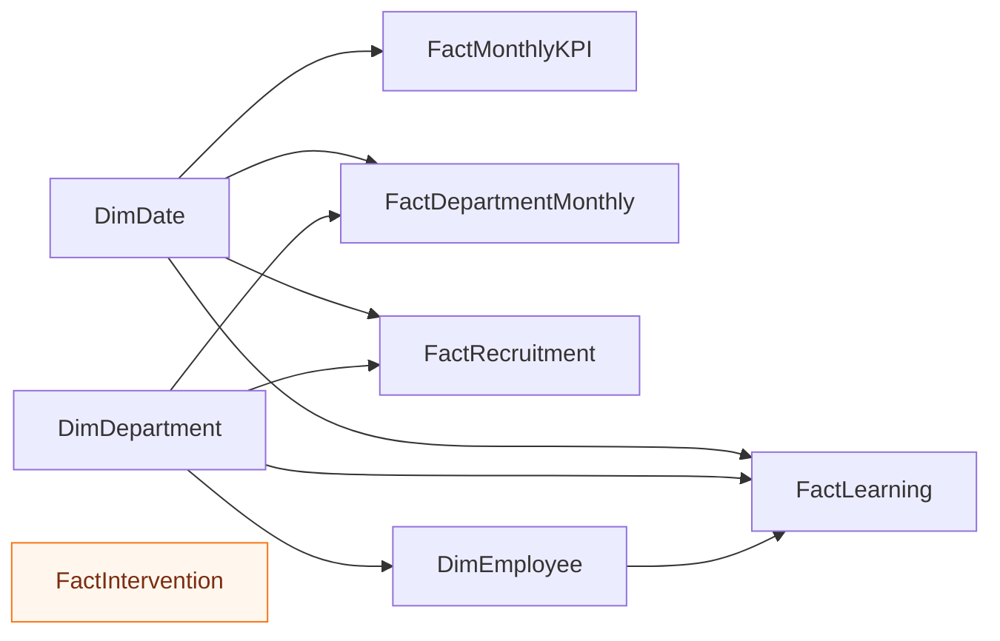

# 📊 Power BI — HR Strategy Analytics Dashboard

<p align="center">
  <strong>A practical Power BI build guide for transforming synthetic Bangladesh SME HR data into an executive people-analytics report.</strong>
</p>

<p align="center">
  
  
  
  
  
  
</p>

---

## 🎯 Purpose

This folder provides the assets and instructions required to build a **six-page Power BI HR analytics report** for the fictional company **Nabodoy Commerce & Services Ltd.**

The report demonstrates how an HR Executive can move beyond operational reporting and communicate:

- workforce risks;
- recruitment quality;
- employee turnover and retention;
- learning and manager capability;
- performance and employee experience;
- compliance, people risk and strategic initiative progress.

> **Data notice:** Every record in this project is synthetic and intended only for portfolio practice, education and dashboard prototyping.

---

## ⚡ Quick Start

1. Download or clone the repository.
2. Open **Power BI Desktop**.
3. Select **Get Data → Text/CSV**.
4. Import the files from [`../../data/csv/`](../../data/csv/).
5. Build the model using [`data_model.md`](data_model.md).
6. add the supplied measures from [`measures.dax`](measures.dax).
7. import [`theme.json`](theme.json) from **View → Themes → Browse for themes**.
8. rebuild the six report pages using the references in [`dashboard-images/`](dashboard-images/) or [`mockups/`](mockups/).
9. save the final file as:

```text
BD_HR_Strategy_Analytics_Dashboard.pbix
```

---

## 🧰 Included Power BI Assets

| Asset | Purpose | How to use |
|---|---|---|
| [`data_model.md`](data_model.md) | Recommended star-schema relationships | Follow before creating visuals |
| [`measures.dax`](measures.dax) | Starter workforce and people KPI measures | Copy into a dedicated measure table |
| [`theme.json`](theme.json) | Consistent report colors and styling | Import through the Power BI Themes menu |
| [`dashboard-images/`](dashboard-images/) | High-resolution report-page references | Use while recreating each page |
| [`mockups/`](mockups/) | Alternative dashboard concepts | Use for layout inspiration |
| [`power-bi-dashboard-images.zip`](power-bi-dashboard-images.zip) | Downloadable dashboard image package | Extract locally for offline reference |
| [`../../data/csv/`](../../data/csv/) | Central CSV dataset folder | Primary Power BI data source |

---

## 👥 Task Assignment and Build Plan

| Task ID | Assigned to | Priority | Deliverable | Status |
|---|---|---:|---|---|
| PBI-01 | Musa | High | Import and validate all CSV files | Ready |
| PBI-02 | Musa | High | Create date and department dimensions | Ready |
| PBI-03 | Musa | High | Configure one-to-many relationships | Ready |
| PBI-04 | Musa | High | Add and format core DAX measures | Ready |
| PBI-05 | Musa | High | Build Executive Overview | Ready |
| PBI-06 | Musa | High | Build Workforce & Turnover page | Ready |
| PBI-07 | Musa | Medium | Build Talent Acquisition page | Ready |
| PBI-08 | Musa | Medium | Build Learning & Manager Capability page | Ready |
| PBI-09 | Musa | Medium | Build Performance & Employee Experience page | Ready |
| PBI-10 | Musa | Medium | Build Compliance, Risk & Initiatives page | Ready |
| PBI-11 | Musa | High | Validate calculations, filters and interactions | Pending build |
| PBI-12 | Musa | High | Export screenshots and publish portfolio version | Pending build |

### Definition of done

A task is complete when:

- the visual uses the correct source table and measure;
- filters and cross-highlighting work correctly;
- percentage and currency formats are consistent;
- the page includes a visible **Synthetic Demo Data** label;
- the page has been checked at 100% and presentation view;
- no employee-level score is presented as an automated employment decision.

---

## 🗂️ Recommended Data Model

Use a **star schema** instead of connecting every CSV directly to every other CSV.



### Relationship rules

- Dimensions filter facts using **one-to-many** relationships.
- Prefer **single-direction filtering** from dimensions to facts.
- Use a dedicated calendar table and mark it as the official date table.
- Keep percentage fields stored as decimals and format them as percentages in Power BI.
- Avoid many-to-many relationships unless a documented bridge table is required.
- Keep intervention tracking as a small management table unless it needs a shared dimension.

---

## 📐 Report Page Specification

### 1. Executive Overview

**Objective:** Give senior leadership a one-page summary of the workforce transformation.

Recommended visuals:

- headcount KPI;
- annualized turnover KPI;
- absenteeism KPI;
- average time-to-fill KPI;
- engagement KPI;
- compliance completion KPI;
- turnover and absenteeism trend;
- department people-risk ranking;
- strategic initiative progress;
- key leadership insight box.

Reference: [`dashboard-images/01-executive-overview.png`](dashboard-images/01-executive-overview.png)

### 2. Workforce & Turnover

**Objective:** Explain where employee exits and retention risks are concentrated.

Recommended visuals:

- active headcount;
- total exits;
- annualized turnover;
- early attrition;
- retention rate;
- average tenure;
- turnover trend;
- voluntary versus involuntary turnover by department;
- department risk matrix;
- exit-reason analysis.

Reference: [`dashboard-images/02-workforce-turnover.png`](dashboard-images/02-workforce-turnover.png)

### 3. Talent Acquisition

**Objective:** Measure recruitment speed, efficiency and new-hire quality.

Recommended visuals:

- time-to-fill;
- cost per hire;
- applicants;
- interview-to-offer rate;
- offer acceptance rate;
- 90-day retention;
- recruitment funnel;
- source quality comparison;
- hiring by department;
- open requisition tracker.

Reference: [`dashboard-images/03-talent-acquisition.png`](dashboard-images/03-talent-acquisition.png)

### 4. Learning & Manager Capability

**Objective:** Connect learning activity to manager and workforce capability.

Recommended visuals:

- training completion;
- learning hours per employee;
- pre- and post-assessment improvement;
- manager effectiveness;
- succession readiness;
- skill-gap closure;
- program comparison;
- manager effectiveness versus team performance;
- learning initiative table.

Reference: [`dashboard-images/04-learning-manager-capability.png`](dashboard-images/04-learning-manager-capability.png)

### 5. Performance & Employee Experience

**Objective:** Show whether workforce performance is sustainable and supported by a healthy employee experience.

Recommended visuals:

- engagement score;
- performance score;
- absenteeism;
- overtime ratio;
- wellbeing index;
- recognition participation;
- engagement trend;
- department comparison;
- absenteeism versus overtime scatter plot;
- employee pulse cards;
- action-priority table.

Reference: [`dashboard-images/05-performance-employee-experience.png`](dashboard-images/05-performance-employee-experience.png)

### 6. Compliance, Risk & Strategic Initiatives

**Objective:** Help leadership review HR governance, audit issues and transformation progress.

Recommended visuals:

- compliance completion;
- policy acknowledgement;
- open audit issues;
- people-risk index;
- initiative completion;
- AI-assisted task adoption;
- compliance trend;
- department risk ranking;
- audit issue summary;
- strategic initiative tracker;
- ten HR contribution areas.

Reference: [`dashboard-images/06-compliance-risk-strategic-initiatives.png`](dashboard-images/06-compliance-risk-strategic-initiatives.png)

---

## 🧮 Starter DAX Measures

The supplied [`measures.dax`](measures.dax) includes starter calculations such as:

```DAX
Headcount =
MAX ( FactMonthlyKPI[headcount] )

Turnover Rate =
AVERAGE ( FactMonthlyKPI[annualized_turnover_rate] )

Absenteeism Rate =
AVERAGE ( FactMonthlyKPI[absenteeism_rate] )

Average Engagement =
AVERAGE ( FactMonthlyKPI[avg_engagement_score] )
```

### Recommended additional measures

```DAX
Net Headcount Change =
SUM ( FactMonthlyKPI[hires] ) - SUM ( FactMonthlyKPI[exits] )

Average Time to Fill =
AVERAGE ( FactMonthlyKPI[avg_time_to_fill_days] )

Training Completion Rate =
AVERAGE ( FactMonthlyKPI[training_completion_rate] )

Compliance Completion Rate =
AVERAGE ( FactMonthlyKPI[compliance_documentation_rate] )

High Risk Employee Count =
CALCULATE (
    DISTINCTCOUNT ( DimEmployee[employee_id] ),
    DimEmployee[risk_band] = "High",
    DimEmployee[employment_status] = "Active"
)
```

> Validate table and column names after import. Power BI may rename fields depending on query transformations.

---

## 🎛️ Recommended Slicers

Use a limited set of synchronized slicers:

| Slicer | Recommended pages |
|---|---|
| Date range | All analytical pages |
| Department | All pages |
| Phase | Executive and intervention pages |
| Risk band | Workforce and risk pages |
| Employment status | Workforce page |
| Recruitment source | Talent Acquisition |
| Learning program | Learning page |
| Initiative status | Compliance and initiatives page |

Avoid adding too many slicers to one page. Prioritize the filters that materially change the management decision.

---

## 🧑‍💻 Usability Guide

### For beginners

Start with only three CSV files:

1. `monthly_hr_kpis.csv`
2. `department_scorecard.csv`
3. `intervention_impact.csv`

Build the **Executive Overview** first. After the KPI cards and two main charts work correctly, add recruitment, employee and learning data.

### For portfolio users

Use the dashboard to demonstrate:

- HR business acumen;
- people-analytics capability;
- Power BI data modelling;
- DAX knowledge;
- dashboard storytelling;
- evidence-based HR intervention planning;
- responsible use of employee data.

### For interview presentation

Use a three-part narrative:

1. **Problem:** rapid growth created turnover, manager capability and compliance risks.
2. **Intervention:** HR introduced structured hiring, performance, learning, workload and governance controls.
3. **Outcome:** the dashboard tracks simulated improvement and shows where leadership action is still required.

### For classroom or self-practice

Try these exercises:

- recreate one page without copying the mockup exactly;
- replace one chart with a more decision-useful visual;
- add a tooltip page for KPI definitions;
- create a drill-through page for departments;
- build a mobile layout;
- write three new DAX measures;
- explain why the report does not prove causation.

---

## ✅ Quality Assurance Checklist

### Data

- [ ] All CSV files load without errors.
- [ ] Dates have the correct data type.
- [ ] Percentages are stored and formatted consistently.
- [ ] Employee IDs are unique where expected.
- [ ] Blank values are reviewed before visualisation.

### Model

- [ ] Relationships are one-to-many where intended.
- [ ] Filter direction is controlled.
- [ ] The calendar table covers the complete reporting period.
- [ ] No ambiguous relationship path exists.
- [ ] Measures are stored in a dedicated measure table.

### Visuals

- [ ] Titles describe the business question.
- [ ] Colors remain consistent across pages.
- [ ] High risk does not rely on color alone.
- [ ] Data labels are readable at normal zoom.
- [ ] Slicers are synchronized where appropriate.
- [ ] Decorative elements do not obscure data.

### Portfolio readiness

- [ ] The report contains a synthetic-data disclaimer.
- [ ] The `.pbix` file uses a professional filename.
- [ ] Screenshots are exported at high resolution.
- [ ] The README explains the business problem and solution.
- [ ] No real employee or confidential company data is included.

---

## ♿ Accessibility and Responsible Use

- Use strong contrast between text and backgrounds.
- Do not communicate risk using red and green alone; include labels or icons.
- Add alternative text to key visuals.
- Keep font sizes readable for presentation and exported screenshots.
- Treat employee risk scores as prompts for human review, not automated decisions.
- Do not use this model for disciplinary action, termination or promotion decisions.
- Validate any predictive model for bias, accuracy and business relevance before operational use.

---

## 📦 Expected Final Deliverables

```text
dashboards/power-bi/
├── BD_HR_Strategy_Analytics_Dashboard.pbix
├── README.md
├── data_model.md
├── measures.dax
├── theme.json
├── dashboard-images/
├── mockups/
└── power-bi-dashboard-images.zip
```

The native `.pbix` file is the only major practice deliverable not prebuilt in this repository. The data, model guidance, DAX starters, theme and visual references are provided so the learner can build and explain the report independently.

---

## 👤 Portfolio Owner

**Musa**  
HR Professional · People Analytics · Excel · Power BI · SQL · Python

---

<p align="center">
  <strong>Build the model. Explain the business problem. Show the HR impact.</strong>
</p>
