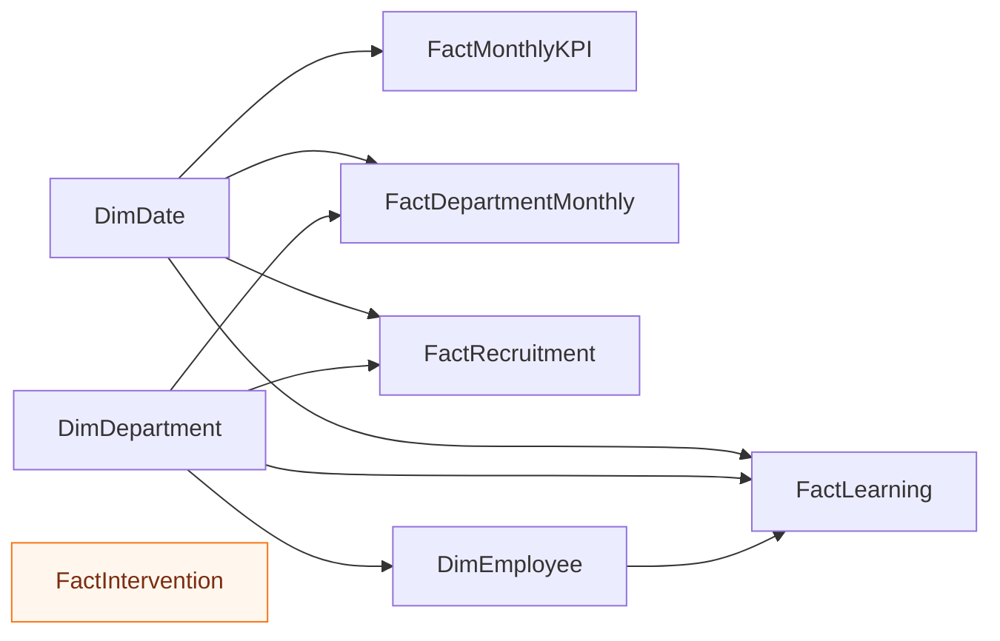

# 📊 Power BI — HR Strategy Analytics Dashboard

<p align="center">
  <strong>Build a six-page executive people-analytics report for a completely synthetic Bangladesh SME transformation case.</strong>
</p>

<p align="center">
  
  
  
  
  
  
</p>

---

## 🎯 Purpose

This folder contains the guidance and assets required to build a native Power BI report for the fictional company **Nabodoy Commerce & Services Ltd.**

The report should help leadership understand:

- workforce growth and turnover;
- department people risk;
- recruitment speed and quality;
- learning and manager capability;
- performance and employee experience;
- compliance and strategic initiative progress.

> All data is synthetic. Employee-level risk must remain subject to context, fairness checks and human review.

## ⚡ Quick Start

1. Download or clone the repository.
2. Open **Power BI Desktop**.
3. Select **Get Data → Text/CSV**.
4. Import files from [`../../data/csv/`](../../data/csv/).
5. Follow [`data_model.md`](data_model.md).
6. Create a dedicated measure table.
7. Add measures from [`measures.dax`](measures.dax).
8. Import [`theme.json`](theme.json) through **View → Themes → Browse for themes**.
9. Rebuild the six pages using [`dashboard-images/`](dashboard-images/).
10. Save the report as:

```text
BD_HR_Strategy_Analytics_Dashboard.pbix
```

## 🧰 Included Assets

| Asset | Purpose | Use |
|---|---|---|
| [`data_model.md`](data_model.md) | Star-schema guidance | Build relationships before visuals |
| [`measures.dax`](measures.dax) | Starter KPI calculations | Copy into a measure table |
| [`theme.json`](theme.json) | Consistent report styling | Import through Themes |
| [`dashboard-images/`](dashboard-images/) | High-resolution page references | Rebuild page layouts |
| [`mockups/`](mockups/) | Alternative concepts | Use as design inspiration |
| [`power-bi-dashboard-images.zip`](power-bi-dashboard-images.zip) | Offline preview bundle | Extract locally |
| [`../../data/csv/`](../../data/csv/) | Central CSV source | Primary report input |
| [`../../sql/README.md`](../../sql/README.md) | SQLite cleaning and views | Validate data before BI use |

## 🧩 Build Plan

| Task ID | Priority | Deliverable | Status |
|---|---:|---|---|
| PBI-01 | High | Import and profile all CSV files | Ready |
| PBI-02 | High | Create `DimDate` and `DimDepartment` | Ready |
| PBI-03 | High | Configure one-to-many relationships | Ready |
| PBI-04 | High | Create and format DAX measures | Ready |
| PBI-05 | High | Build Executive Overview | Pending build |
| PBI-06 | High | Build Workforce & Turnover | Pending build |
| PBI-07 | Medium | Build Talent Acquisition | Pending build |
| PBI-08 | Medium | Build Learning & Manager Capability | Pending build |
| PBI-09 | Medium | Build Performance & Employee Experience | Pending build |
| PBI-10 | Medium | Build Compliance, Risk & Initiatives | Pending build |
| PBI-11 | High | Test calculations, slicers and interactions | Pending build |
| PBI-12 | High | Export screenshots and add `.pbix` | Pending build |
| PBI-13 | High | Complete ethics and release review | Pending release |

### Definition of done

A task is complete when:

- the correct source table and measure are used;
- calculations match the source CSV or validated SQL view;
- slicers and cross-highlighting work correctly;
- number, percentage and currency formats are consistent;
- every page displays **Synthetic Demo Data**;
- risk is not communicated by colour alone;
- employee-risk output remains a human-review prompt;
- the page is readable at normal zoom and presentation view.

## 🗂️ Recommended Star Schema



### Relationship rules

- Use one-to-many relationships from dimensions to facts.
- Prefer single-direction filters.
- Mark the calendar table as the official date table.
- Store percentage values as decimals and format them in Power BI.
- Avoid undocumented many-to-many relationships.
- Keep intervention tracking standalone unless a shared dimension is required.

## 📐 Six Report Pages

| Page | Management question | Main visuals |
|---|---|---|
| Executive Overview | Where does leadership need to focus now? | KPIs, trends, department risk and initiative progress |
| Workforce & Turnover | Where are retention risks concentrated? | Turnover, early attrition, tenure and exit drivers |
| Talent Acquisition | Is hiring faster without reducing quality? | Funnel, source quality, time-to-fill and retention |
| Learning & Manager Capability | Are programmes improving capability? | Completion, assessment gain and manager effectiveness |
| Performance & Employee Experience | Is performance sustainable? | Engagement, absence, overtime, wellbeing and actions |
| Compliance, Risk & Initiatives | Are governance actions on track? | Compliance, audit risk and strategic progress |

Page references:

1. [`dashboard-images/01-executive-overview.png`](dashboard-images/01-executive-overview.png)
2. [`dashboard-images/02-workforce-turnover.png`](dashboard-images/02-workforce-turnover.png)
3. [`dashboard-images/03-talent-acquisition.png`](dashboard-images/03-talent-acquisition.png)
4. [`dashboard-images/04-learning-manager-capability.png`](dashboard-images/04-learning-manager-capability.png)
5. [`dashboard-images/05-performance-employee-experience.png`](dashboard-images/05-performance-employee-experience.png)
6. [`dashboard-images/06-compliance-risk-strategic-initiatives.png`](dashboard-images/06-compliance-risk-strategic-initiatives.png)

## 🧮 Starter DAX

```DAX
Headcount =
MAX ( FactMonthlyKPI[headcount] )

Turnover Rate =
AVERAGE ( FactMonthlyKPI[annualized_turnover_rate] )

Absenteeism Rate =
AVERAGE ( FactMonthlyKPI[absenteeism_rate] )

Average Engagement =
AVERAGE ( FactMonthlyKPI[avg_engagement_score] )

Net Headcount Change =
SUM ( FactMonthlyKPI[hires] ) - SUM ( FactMonthlyKPI[exits] )
```

Validate table and column names after Power Query transformations.

## 🎛️ Recommended Slicers

| Slicer | Pages |
|---|---|
| Date range | All analytical pages |
| Department | All pages |
| Phase | Executive and intervention pages |
| Risk band | Workforce and risk pages |
| Employment status | Workforce page |
| Recruitment source | Talent Acquisition |
| Learning programme | Learning page |
| Initiative status | Compliance and initiatives |

Use only filters that materially change the management decision.

## 🧑‍💻 Usability

### Beginner

Start with `monthly_hr_kpis.csv`, `department_scorecard.csv` and `intervention_impact.csv`. Build the Executive Overview before adding employee, recruitment and learning detail.

### Portfolio builder

Demonstrate HR business acumen, data modelling, DAX, storytelling, intervention planning and responsible employee-data use.

### Interview presentation

Explain the business problem, connected diagnosis, intervention design, simulated result, remaining risk and ethical limitation.

### Advanced practice

- connect Power BI to the SQLite BI-ready views;
- add tooltip and drill-through pages;
- build a mobile layout;
- write additional measures;
- compare CSV and SQL results;
- explain why simulated before-and-after movement does not prove causation.

## ✅ Quality Assurance

### Data and model

- [ ] CSV files or SQLite views load without errors.
- [ ] Dates and percentage formats are correct.
- [ ] Relationships are one-to-many where intended.
- [ ] No ambiguous filter path exists.
- [ ] Measures are stored in a dedicated table.

### Visuals

- [ ] Titles answer a business question.
- [ ] Colours remain consistent.
- [ ] Risk does not rely on colour alone.
- [ ] Labels remain readable at normal zoom.
- [ ] Decorative elements do not obscure data.

### Responsible use

- [ ] Every page shows a synthetic-data notice.
- [ ] Employee risk requires human review.
- [ ] No visual claims proven causation.
- [ ] No real personal or confidential data is present.
- [ ] Accessibility checks are complete.

## 📦 Final Deliverables

```text
dashboards/power-bi/
├── BD_HR_Strategy_Analytics_Dashboard.pbix
├── README.md
├── data_model.md
├── measures.dax
├── theme.json
├── dashboard-images/
├── mockups/
└── power-bi-dashboard-images.zip
```

The native `.pbix` file remains the primary practice deliverable and must not be fabricated.

## 🚀 Release Gate

- [ ] Add the final `.pbix` file.
- [ ] Export six high-resolution screenshots.
- [ ] Verify calculations and interactions.
- [ ] Confirm synthetic and human-review labels.
- [ ] Update version and changelog.
- [ ] Include only one current unified distribution ZIP.
- [ ] Attach the ZIP to the GitHub Release.

---

<p align="center"><strong>Build the model first, validate the measures, then design the story.</strong></p>
